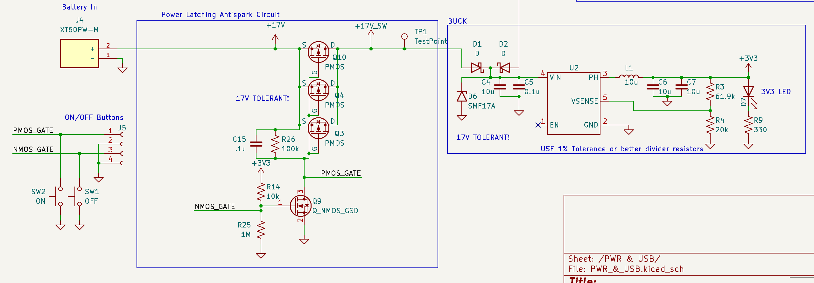

# <div align="center">Autonomous Police Car</div>


### <div align="center"> ECE 148 Final Project </div>

#### <div align="center"> Team 11 Winter 2025 </div>

<div align="center">
    
</div>

## Table of Contents

  <ol>
    <li><a href="#team-members">Team Members</a></li>
    <li><a href="#abstract">Abstract</a></li>
    <li><a href="#what-we-promised">What We Promised</a></li>
    <li><a href="#accomplishments">Accomplishments</a></li>
    <li><a href="#challenges">Challenges</a></li>
    <li><a href="#final-project-videos">Final Project Videos</a></li>
    <li><a href="#hardware">Hardware</a></li>
    <li><a href="#software">Software</a></li>
        <ul>
            <li><a href="#slam-simultaneous-localization-and-mapping">SLAM (Simultaneous Localization and Mapping)</a></li>
            <li><a href="#obstacle-avoidance">Obstacle Avoidance</a></li>
        </ul>
    <li><a href="#gantt-chart">Gantt Chart</a></li>
    <li><a href="#course-deliverables">Course Deliverables</a></li>
    <li><a href="#project-reproduction">Project Reproduction</a></li>
    <li><a href="#acknowledgements">Acknowledgements</a></li>
  </ol>

<hr>

## Team Members

- MingWei Yeoh - ECE - 2025
- Trevor
- Minh Quach
- Jose

<hr>

## Abstract

An realistic looking autonomous car that can activate lights when it detects a speeding car and autonomously pull it over or initiate a chase.

Past MAE projects haven’t tried to use car following for a real task, nor make their autonomous car LOOK like an actual car.
Mechanically it will be a challenge to mount all the electronics inside of a small car body.

<hr>

## What We Promised

### Must Have

- LEDs
- Communication between LED controller and Jetson
- Body shell Mounting
- Chase the car
- Yolo running on OAK-D Camera

### Nice to Have

- Cool PCB
- Clean Electronics mounting
- A Siren
<hr>

## Accomplishments

- Follows car
- LEDs work great
- 150A Soft start power switch works great
<hr>

## Challenges

- Jetson not connecting to Wifi
- ROS2 not configured correctly to run our nodes
- I2C reaching bugged state
<hr>

## Final Project Videos

[](https://www.youtube.com/watch?v=_BfZI85ATvo)

<hr>

## Hardware

Link to the OnShape [CAD](https://cad.onshape.com/documents/6c423dcbeb2588a9d7785133/w/5859bc8aee528f453679c661/e/83214a9dc768b66fa2069d19?renderMode=0&uiState=67d3caa0a720212af3f91fbd)


- **Green** - Body shell mounting method. It uses 8x3mm magnets.
- **Purple** - Reference geometry from the car
- **Black** - Structural 3D Printed pieces
- **Orange** - 3D Printed Spacers

The design is super clean and allows the body shell to easily cover all the electronics.


**Additional Hardware Necessary**

- Custom LED driver PCB
- Custom LED module
- 8x3mm Magnets
- 3mm bolts
- Body shell

## PCB

### High Level Overview

- Embedded EPS32S3
- USB C Port
- Anti spark power switch capable of 150 A
- Buzzer (for siren)
- 2x High Powered led driver
- 3x WS2815 Led Controllers
- Communication with Jetson via I2C
- 3 Spare GPIOs (if needed)
- Onboard VBAT -> 3V3 Buck regulator


**Power**
Snippet from the schematic. 3 Low RDson PMOS' act like the switch. When the on button is pressed, the 4s Lipo gets fed into the onboard buck regulator to power the microcontroller.


### Assembly

Hand Assembled. Theres a lot of parts


### Bringup

**LEDS**

</br>


**I2C**
ESP32 acts as a peripheral device with address 0x55. It takes in a 2 byte command. 0x00 and 0x11.
0x00 Turns on LEDs and 0x11 turns off LEDs.


## Software - Robocar Visual Pursuit Package

A ROS2 package for autonomous vehicle pursuit using computer vision and DepthAI. This package enables a robocar to detect and follow another vehicle using visual tracking.

### Table of Contents

- [Features](#features)
- [Prerequisites](#prerequisites)
- [Installation](#installation)
- [Nodes](#nodes)
  - [Car Detection Node](#car-detection-node)
  - [Lane Guidance Node](#lane-guidance-node)
  - [Parameter Tuner Node](#parameter-tuner-node)
- [Topics](#topics)
- [Launch Files](#launch-files)
- [Parameter Tuning](#parameter-tuning)
- [Troubleshooting](#troubleshooting)
- [Configuration Files](#configuration-files)

### Features

- Real-time car detection using YOLO and DepthAI
- Adaptive PID-based steering control
- Dynamic throttle management
- Real-time parameter tuning interface
- Parameter persistence across launches
- Robust tracking with lost-frame handling

### Prerequisites

- ROS2
- DepthAI
- OpenCV
- Python 3.8+

### Installation

1. Clone this repository into your ROS2 workspace:

```bash
cd ~/ros2_ws/src
git clone <repository_url> robocar_visual_pursuit_pkg
```

2. Install dependencies:

```bash
cd ~/ros2_ws
rosdep install --from-paths src --ignore-src -r -y
```

3. Build the package:

```bash
colcon build --packages-select robocar_visual_pursuit_pkg
```

### Nodes

#### Car Detection Node

The car detection node uses YOLO and DepthAI to detect vehicles in the camera feed and calculate their position relative to the robot.

**Parameters:**

- `confidence_threshold` (0.0-1.0): Confidence threshold for car detection
- `camera_centerline` (0.0-1.0): Normalized position of camera centerline
- `error_threshold` (0.0-1.0): Error threshold for steering control
- `iou_threshold` (0.0-1.0): IOU threshold for object detection
- `max_lost_frames` (0-30): Maximum number of frames to track lost object

**Topics:**

- Subscribes: `/camera/color/image_raw` (sensor_msgs/Image)
- Publishes: `/centroid` (std_msgs/Float32)

#### Lane Guidance Node

The lane guidance node implements PID control for steering and adaptive throttle management based on tracking error.

**Parameters:**

- `Kp_steering` (0.0-5.0): Proportional gain for steering control
- `Ki_steering` (0.0-2.0): Integral gain for steering control
- `Kd_steering` (0.0-2.0): Derivative gain for steering control
- `max_throttle` (0.0-1.0): Maximum throttle value
- `min_throttle` (0.0-0.5): Minimum throttle value

**Topics:**

- Subscribes: `/centroid` (std_msgs/Float32)
- Publishes: `/cmd_vel` (geometry_msgs/Twist)

#### Parameter Tuner Node

A dedicated node for real-time parameter tuning with persistent storage.

**Features:**

- Real-time parameter adjustment via rqt_reconfigure
- Parameter persistence across launches
- Automatic parameter forwarding to relevant nodes

### Topics

| Topic                     | Type                | Description                              |
| ------------------------- | ------------------- | ---------------------------------------- |
| `/camera/color/image_raw` | sensor_msgs/Image   | Raw camera feed                          |
| `/centroid`               | std_msgs/Float32    | Normalized target position (-1.0 to 1.0) |
| `/cmd_vel`                | geometry_msgs/Twist | Vehicle control commands                 |

### Launch Files

#### Car Pursuit Launch

Launch the complete visual pursuit system:

```bash
ros2 launch robocar_visual_pursuit_pkg car_pursuit_launch.py
```

This launches:

- Car detection node
- Lane guidance node
- Parameter tuner node
- VESC interface node

### Parameter Management

Parameters are managed through ROS2's rqt dynamic reconfigure system and YAML configuration files. The default parameters are stored in `config/default_params.yaml`.

#### Available Parameters

- `camera_centerline` (float, default: 0.5): Normalized position of camera centerline
- `confidence_threshold` (float, default: 0.2): Confidence threshold for car detection
- `debug_cv` (int, default: 0): Enable/disable debug visualization
- `error_threshold` (float, default: 0.5): Error threshold for steering control
- `iou_threshold` (float, default: 0.5): IOU threshold for object detection
- `max_lost_frames` (int, default: 30): Maximum number of frames to track lost object
- `model_path` (string): Path to YOLO model weights
- `use_sim_time` (bool, default: false): Use simulation time

#### Parameter Tuning

1. Launch the visual pursuit node:

```bash
ros2 launch robocar_visual_pursuit_pkg visual_pursuit.launch.py
```

2. Open rqt reconfigure:

```bash
ros2 run rqt_reconfigure rqt_reconfigure
```

3. Adjust parameters in real-time using the rqt interface

4. Export current parameters to YAML:

```bash
ros2 param dump /visual_pursuit_node > config/my_params.yaml
```

5. Load custom parameters at launch:

```bash
ros2 launch robocar_visual_pursuit_pkg visual_pursuit.launch.py params_file:=config/my_params.yaml
```

Note: You may need to consolidate the yaml params from multiple files as params dump specific to their own node but all nodes read from default_params.yaml by default. This will be fixed in a future update

### Troubleshooting

Common issues and solutions:

1. **Parameter Changes Not Saving**

   - Verify rqt_reconfigure is running
   - Check write permissions in the config directory
   - Ensure the parameter dump command executed successfully

2. **Node Not Starting**

   - Check if all required configuration files exist
   - Verify file paths in launch files
   - Ensure ROS2 environment is properly sourced

3. **Detection Issues**
   - Verify camera connection and permissions
   - Check model path in configuration
   - Adjust confidence and IOU thresholds

For additional help, check the ROS2 logs:

```bash
ros2 log info /visual_pursuit_node
```

### Configuration Files

The package uses several configuration files in the `config` directory:

- `default_params.yaml`: Default parameters for the visual pursuit system
- `car_detection_node`: Configuration for car detection parameters
- `lane_guidence`: Lane guidance system configuration
- `ros_racer_calibration.yaml`: Calibration parameters for the robocar

#### Configuration Structure

Each configuration file serves a specific purpose:

1. **Visual Pursuit Parameters** (`default_params.yaml`)

   - Core parameters for the visual pursuit system
   - Modified through rqt_reconfigure
   - Can be exported and loaded at runtime

2. **Car Detection Configuration** (`car_detection_node`)

   - YOLO model configuration
   - Detection thresholds and parameters
   - Camera settings

3. **Lane Guidance Configuration** (`lane_guidence`)

   - Lane detection parameters
   - Steering control settings
   - PID tuning values

4. **Calibration Parameters** (`ros_racer_calibration.yaml`)
   - Hardware-specific calibration
   - Motor and servo settings
   - Sensor calibration values

To modify these configurations:

1. Use rqt_reconfigure for real-time parameter tuning
2. Export modified parameters to YAML files
3. Load specific configuration files at launch time

Example of loading multiple configuration files:

```bash
ros2 launch robocar_visual_pursuit_pkg visual_pursuit.launch.py \
  params_file:=config/my_params.yaml \
  calibration_file:=config/ros_racer_calibration.yaml
```

## Gantt Chart


## Course Deliverables

Here are our autonomous laps as part of our class deliverables:

- DonkeyCar Reinforcement Laps: https://youtube.com/shorts/6msSXXdx4cQ?feature=share
- GPS Laps: https://youtu.be/pAPebhBlGDo
- Lane Following: https://youtu.be/QzcPgDxxi5c

- All Slides: https://drive.google.com/drive/folders/1qeRSDj4K1PtiiYxJ_8OacECK8fxUN1bn?usp=sharing

## Acknowledgements

Special thanks to Alex and Winston!

<hr>
